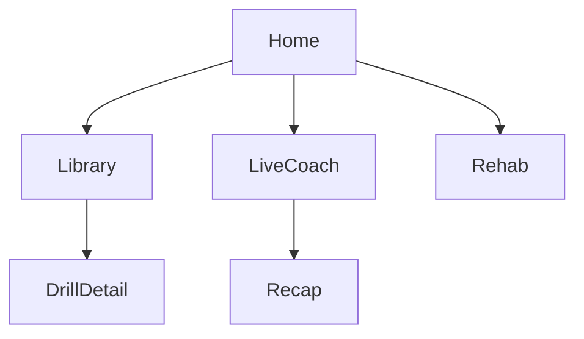

# SetPoint AI — Future Roadmap (Agent Handoff)

Use this document as the starting context for the next agent. Do **not** re-scaffold the app; continue from the existing Flutter project at repo root.

---

## Product summary

**SetPoint AI** is an AI-powered motion analysis platform for discipline-specific sports training. Launch sports: **football, volleyball, basketball**. Athletes record drills/game clips on a phone; pose estimation compares them to coach-built reference libraries and returns tips on form, balance, symmetry, timing, and sport-specific metrics.

**Future goal (later):** live AI referee for hard in-game calls, reusing the same vision stack.

UI mockups were volleyball-first (SetPoint orange `#FF7F32`); product is multi-sport — keep volleyball content as default mock data until Iteration 7 (sport switcher).

Display name may change later; branding strings live in `lib/core/constants/app_strings.dart`.

**Repo:** https://github.com/e88040429-code/SportsAiAPP.git (Flutter at root, package `setpoint_ai`, org `com.setpoint`)

**Run (dev has no mobile SDKs yet):**
```bash
flutter run -d chrome
```
Platforms enabled: Android, iOS, **web**. Prefer Chrome for local UI work.

---

## What is already done

| Iteration | Status | What shipped |
|-----------|--------|--------------|
| **0 Foundation** | Done | `.gitignore`, Flutter scaffold, theme, `go_router` 5-tab shell, packages `google_fonts` + `go_router`, web |
| **1 Home UI** | Done | Scrollable Home dashboard with mock data matching mockup |

**Home includes:** greeting + avatar, metric cards (Form/Drills/This Week), Today's Session → `/coach`, Common Skills → `/library/drill/:id`, Continue Learning with progress bars.

**Still placeholders:** Library, Drill Detail, Coach, Recap, Rehab.

### Key paths
```
lib/
  main.dart, app.dart
  core/theme/app_colors.dart, app_theme.dart
  core/router/app_router.dart          # StatefulShellRoute tabs
  core/constants/app_strings.dart
  features/home/                       # full UI + mock data
  features/library|coach|recap|rehab/  # placeholders
```

### Theme tokens
- Primary `#FF7F32`, background `#F8F8F8`, surface white, coach dark `#121212`
- Card radius ~20–24px; Inter via `google_fonts`

### Navigation
Tabs: Home | Library | Coach | Recap | Rehab  
Drill detail: `/library/drill/:drillId` (pushed on root navigator)

### Packages in use
`google_fonts`, `go_router` only. Defer camera/ML/charts until the iteration that needs them.

### Conventions for new work
- Feature folders under `lib/features/<feature>/` with `data/` + `widgets/`
- Mock Dart models first; no backend yet
- Small iterations: one screen (or one vertical slice) per PR-sized chunk
- Preserve mockup visual language; no purple/generic AI aesthetic drift
- Verify with `flutter analyze` + `flutter test`; run on Chrome
- Do not edit plan files unless asked; commit/push only when asked

---

## Original UI mockup map (target screens)



1. **Home** — done  
2. **Pose Library** — search, Training/Rehab toggle, category chips, skill list  
3. **Drill Detail** — video placeholder, coach row, key positions timeline  
4. **Live Coach** — dark camera HUD, fake skeleton, live metrics (camera later)  
5. **Session Recap** — score ring, You vs Coach, joint angles, rep chart  
6. **Rehab Hub** — readiness, program card, exercise checklist  

---

## Ordered future roadmap

Work in this order unless the user redirects. Each row is one small iteration.

| Iter | Focus | Deliverable | New packages (only when needed) |
|------|--------|-------------|----------------------------------|
| **2** | Pose Library UI | Search, Training/Rehab toggle, chips, core skills list + mock data; tap → drill detail | none |
| **3** | Drill Detail UI | Video placeholder, coach row, key positions list; wired from Library/Home | none (video later) |
| **4** | Live Coach shell | Dark HUD, fake 17-point skeleton overlay, cue bubble, metrics bar, record button UI | none yet |
| **5** | Session Recap UI | Score circle, You vs Coach frames, joint angle rows, rep bar chart | `fl_chart` or custom bars; avoid `percent_indicator` if CustomPaint is enough |
| **6** | Rehab Hub UI | Readiness card, body highlight placeholders, active program, today's exercises checklist | none |
| **7** | Multi-sport switcher | Football / volleyball / basketball selector; shared drill models; Home/Library filter by sport | none |
| **8** | Video + pose pipeline | Pick/record clip, run pose estimation, map keypoints to feedback tips | `image_picker` / `camera`, `google_mlkit_pose_detection` (mobile; web may need alternate path) |
| **9+** | Live AI referee | Real-time hard-call assist on field/court — same vision stack, new product mode | TBD after Iter 8 |

### Suggested next session (Iter 2)
Mirror Home patterns:
- `lib/features/library/data/library_mock_data.dart`
- Widgets: search bar, Training/Rehab segmented control, category chips, featured drill, core skills list
- Replace placeholder in `lib/features/library/library_screen.dart`
- Keep drill detail stub until Iter 3
- Update widget tests for Library section titles

---

## Explicit non-goals (until listed iteration)
- Backend / auth / real user accounts
- Real camera or ML before Iter 8
- Live referee before Iter 9+
- Renaming package unless user asks (display string change is fine via `AppStrings`)

## Known notes
- Dev environment uses **Chrome**, not Android/iOS SDKs yet — keep web-safe UI until Iter 8; gate camera/ML behind mobile platforms
- If a stray nested `chrome/` Flutter project appears from a mistaken `flutter create chrome`, delete it; web lives in root `web/`

## Success criteria for the overall product path
UI mockups complete (2–6) → multi-sport data model (7) → real analysis loop (8) → referee mode (9+), always iterating small and mock-data-first until analysis work begins.
