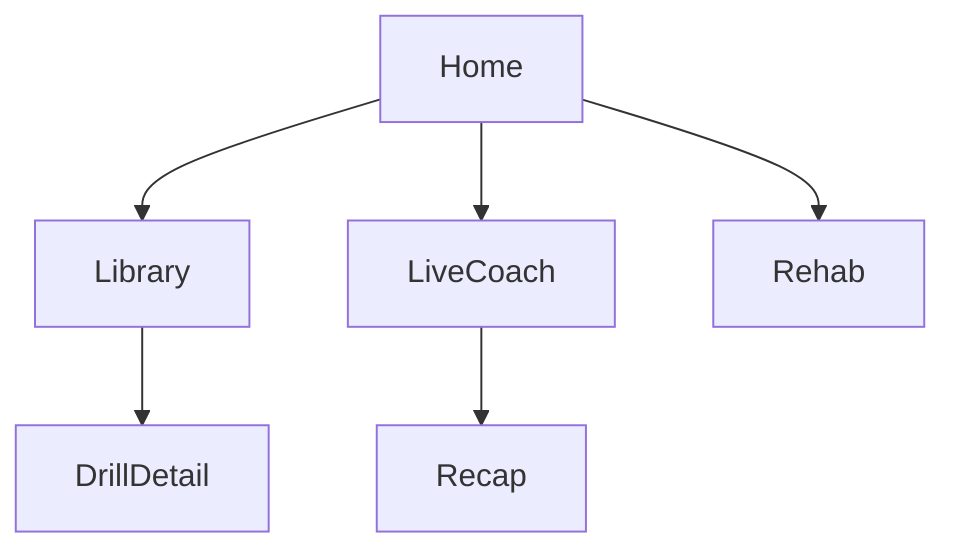

# SetPoint AI — Future Roadmap (Agent Handoff)

Use this document as the starting context for the next agent. Do **not** re-scaffold the app; continue from the existing Flutter project at repo root.

---

## Product summary

**SetPoint AI** is an AI-powered motion analysis platform for discipline-specific sports training. Launch sports: **football, volleyball, basketball**. Athletes record drills/game clips on a phone; pose estimation compares them to coach-built reference libraries and returns tips on form, balance, symmetry, timing, and sport-specific metrics.

**Future goal (later):** live AI referee for hard in-game calls, reusing the same vision stack.

UI mockups were volleyball-first (SetPoint orange `#FF7F32`); product is multi-sport — keep volleyball content as default mock data until Iteration 7 (sport switcher).

Display name may change later; branding strings live in `lib/core/constants/app_strings.dart`.

**Repo:** [https://github.com/e88040429-code/SportsAiAPP.git](https://github.com/e88040429-code/SportsAiAPP.git) (Flutter at root, package `setpoint_ai`, org `com.setpoint`)

**Run (dev has no mobile SDKs yet):**

```bash
flutter run -d chrome
```

Platforms enabled: Android, iOS, **web**. Prefer Chrome for local UI work.

---


## What is already done


| Iteration        | Status | What shipped                                                                                               |
| ---------------- | ------ | ---------------------------------------------------------------------------------------------------------- |
| **0 Foundation** | Done   | `.gitignore`, Flutter scaffold, theme, `go_router` 5-tab shell, packages `google_fonts` + `go_router`, web |
| **1 Home UI**    | Done   | Scrollable Home dashboard with mock data matching mockup                                                   |


**Home includes:** greeting + avatar, metric cards (Form/Drills/This Week), Today's Session → `/coach`, Common Skills → `/library/drill/:id`, Continue Learning with progress bars.

**Still placeholders:** Library, Drill Detail, Coach, Recap, Rehab.

### Key paths

```
lib/
  main.dart, app.dart
  core/theme/app_colors.dart, app_theme.dart
  core/router/app_router.dart          # StatefulShellRoute tabs
  core/constants/app_strings.dart
  features/home/                       # full UI + mock data
  features/library|coach|recap|rehab/  # placeholders
```


### Theme tokens

- Primary `#FF7F32`, background `#F8F8F8`, surface white, coach dark `#121212`
- Card radius ~20–24px; Inter via `google_fonts`


### Navigation

Tabs: Home | Library | Coach | Recap | Rehab  
Drill detail: `/library/drill/:drillId` (pushed on root navigator)

### Packages in use

`google_fonts`, `go_router`, `camera`. Pose overlay is still a **fake painted skeleton** (`FakeSkeletonOverlay` / `PoseSkeletonPainter`). Defer real pose inference until Iteration 8 — use **`pose_detection`** (web + iOS + Android), not ML Kit.

### Conventions for new work

- Feature folders under `lib/features/<feature>/` with `data/` + `widgets/`
- Mock Dart models first; no backend yet
- Small iterations: one screen (or one vertical slice) per PR-sized chunk
- Preserve mockup visual language; no purple/generic AI aesthetic drift
- Verify with `flutter analyze` + `flutter test`; run on Chrome
- Do not edit plan files unless asked; commit/push only when asked

---


## Original UI mockup map (target screens)


```mermaid
flowchart TB
  Home --> Library
  Library --> DrillDetail
  Home --> LiveCoach
  LiveCoach --> Recap
  Home --> Rehab
```


1. **Home** — done
2. **Pose Library** — search, Training/Rehab toggle, category chips, skill list
3. **Drill Detail** — video placeholder, coach row, key positions timeline
4. **Live Coach** — dark camera HUD, fake skeleton, live metrics (camera later)
5. **Session Recap** — score ring, You vs Coach, joint angles, rep chart
6. **Rehab Hub** — readiness, program card, exercise checklist

---


## Ordered future roadmap

Work in this order unless the user redirects. Each row is one small iteration.

| Iter | Focus | Deliverable | New packages (only when needed) |
|------|--------|-------------|----------------------------------|
| **2** | Pose Library UI | Search, Training/Rehab toggle, chips, core skills list + mock data; tap → drill detail | none |
| **3** | Drill Detail UI | Video placeholder, coach row, key positions list; wired from Library/Home | none (video later) |
| **4** | Live Coach shell | Dark HUD, fake 17-point skeleton overlay, cue bubble, metrics bar, record button UI | `camera` (live preview) |
| **5** | Session Recap UI | Score circle, You vs Coach frames, joint angle rows, rep bar chart | `fl_chart` or custom bars |
| **6** | Rehab Hub UI | Readiness card, body highlight placeholders, active program, today's exercises checklist | none |
| **7** | Multi-sport switcher | Football / volleyball / basketball selector; shared drill models; Home/Library filter by sport | none |
| **8** | Video + pose pipeline | See sub-iterations **8.1–8.6** below | [`pose_detection`](https://pub.dev/packages/pose_detection) (web + iOS + Android) |
| **9+** | Live AI referee | Real-time hard-call assist on field/court — same vision stack, new product mode | TBD after Iter 8 |

---

## Iteration 8 — Fake skeleton → real pose detection

**Current state:** Live camera via `CoachCameraPreview`; overlay is `FakeSkeletonOverlay` / `PoseSkeletonPainter` with hardcoded joints; cues/metrics from `CoachMockData`.

**Guiding order:** Detect → draw on body → metrics/cues → compare to reference → recap. Do not jump to coaching tips until the skeleton tracks the athlete correctly.

**Chosen stack: [`pose_detection`](https://pub.dev/packages/pose_detection)** (TFLite / BlazePose-style landmarks)
- Runs on **Flutter Web** (LiteRT.js: WebGPU with WASM fallback), **Android**, and **iOS** with one Dart API — fits Chrome-first development.
- Prefer this over `google_mlkit_pose_detection`, which is mobile-only and blocks web iteration.
- Do **not** add ML Kit unless a later mobile-only quality gap forces a fallback.
- Landmark count is BlazePose-style (~33 points); map down to the painter’s joint/bone model in 8.3 (painter today uses a 17-joint COCO-style layout).

### 8.1 — Add `pose_detection` and pose service shell
- Add `pose_detection` to `pubspec.yaml`.
- Create a small pose service API under something like `lib/features/coach/pose/` (e.g. `PoseDetectorService`) that can start/stop and emit landmarks via a shared `PoseFrame` model.
- Initialize detector once (lite/full/heavy model as needed); dispose cleanly with the Coach screen.
- **Done when:** package resolves; detector creates successfully on Chrome and (when available) mobile; app does not regress existing Coach UI.

### 8.2 — Feed camera / image frames into the detector
- From existing `CameraController` in `CoachCameraPreview`, capture frames for inference (image stream and/or periodic snapshot → `Uint8List` / bytes — web cannot use `dart:io` `File`).
- Call `pose_detection` `detect(...)` on those bytes; throttle (e.g. every Nth frame or ~15–30 FPS) so UI stays smooth.
- Handle front-camera mirroring and preview letterboxing when aligning results to the HUD.
- **Done when:** detector receives frames on Chrome (and mobile when available) with no sustained freezes / OOM.

### 8.3 — Normalize landmarks into painter format
- Map package landmarks (+ confidence) onto the joint + bone list `PoseSkeletonPainter` uses (subset/remap from ~33 → app skeleton).
- Convert image coords → overlay coords (preview aspect ratio / letterboxing / front-cam flip).
- Keep a shared `PoseFrame` so painter and metrics share one source of truth.
- **Done when:** unit-testable mapping exists; sample landmarks paint in the correct places on a still test image or fixed frame (Chrome is fine).

### 8.4 — Replace fake overlay with live skeleton
- In `coach_screen.dart`, swap `FakeSkeletonOverlay()` for a widget fed by live `PoseFrame`s.
- Keep `PoseSkeletonPainter` drawing logic; stop using hardcoded `_normalizedJoints` for the live path.
- Optionally hide overlay or show last-good pose when confidence is low.
- **Done when:** on Chrome (and mobile), skeleton visibly tracks the athlete in Live Coach (not a static fake pose).

### 8.5 — Derive coaching cues and metrics from pose
- From landmarks, compute joint angles (elbow, knee, etc.), symmetry, timing/rep heuristics.
- Drive `CueBubble` and `CoachMetricsBar` from those values instead of `CoachMockData`.
- Later in this slice or as follow-up: compare live pose to Library reference poses (“You vs Coach” inputs).
- **Done when:** cues/metrics update while moving; mock constants are no longer the live source where detection runs.

### 8.6 — Wire recording → Session Recap
- On stop record, persist clip (and/or sampled pose frames) from the session.
- Navigate to Recap with real form score, joint angles, and optional You vs Coach frames (not mock-only).
- **Done when:** a recorded Coach session produces a Recap populated from that session’s pose data.

### Explicit non-goals until later
- Backend / auth / cloud pose storage
- Full sport-rule AI referee (that is **Iter 9+**, reusing this vision stack)
- Adding `google_mlkit_pose_detection` “just in case” — stay on `pose_detection` unless proven insufficient on device

