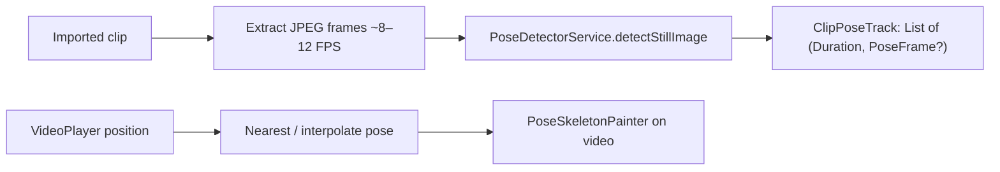

# SetPoint AI — Agent prompt: Clip playback + pose overlay

Use this as the **only** task doc unless you need pose internals from [`SETPOINT_PHASE1_HANDOFF.md`](SETPOINT_PHASE1_HANDOFF.md).

**Repo:** Flutter app at repo root (`setpoint_ai`). Do **not** re-scaffold.  
**Run:** `flutter run -d chrome` (primary). Windows via `C:\dev\SportsAiAPP` junction if building desktop.

Commit / push only if the user asks.

---

## Goal

On the **Clip analysis** page, the athlete must be able to **watch the imported video back** and **see live pose detection overlaid** on the body (same skeleton style as Live Coach / still-photo import).

Still photos already do this (image + `PoseSkeletonPainter`). **Video clips currently play without a skeleton.** Written cues can stay as they are; this slice is playback + overlay.

**Done when:**

1. Import an MP4/WebM (Chrome) → Clip analysis shows the video player.
2. After a short “Reading poses…” pass, play/pause/scrub shows a skeleton that tracks the athlete.
3. Overlay stays aligned with the letterboxed video (mirror/aspect handled).
4. Missing person / unsupported codec fails softly (preview still plays; note why overlay is absent).
5. Still-photo flow does not regress.
6. `flutter analyze` + relevant `flutter test` stay green.

---

## Current code (start here)

| Area | Path |
|------|------|
| Clip analysis UI | `lib/features/coach/widgets/clip_analysis_panel.dart` (`VideoPlayer` + controls; photo overlay already exists) |
| Import + generate | `lib/features/coach/coach_screen.dart` (`_importClip`, `_loadVideoPreview`, `_loadStillImage`) |
| Video load | `lib/features/coach/data/clip_video_loader*.dart` (web blob URL via `package:web`) |
| Still detect | `PoseDetectorService.detectStillImage` in `lib/features/coach/pose/pose_detector_service.dart` |
| Overlay painter | `lib/features/coach/widgets/pose_skeleton_painter.dart` / `live_pose_overlay.dart` |
| Frame model | `lib/features/coach/pose/pose_frame.dart` (COCO-17, normalized 0–1) |
| Import types | `lib/features/coach/data/clip_import_validator.dart` |

**Important:** Clip **written analysis** still uses `ModelPoseLibrary.athleteSequenceFromClip` (synthetic), not real video poses. This task is **playback overlay**, not a full rewrite of Generate/Recap math. Optionally, if a real pose track exists, you *may* feed it into `ClipFormAnalyzer` later — out of scope unless leftover time.

---

## Recommended design (do this)

**Precompute a timed pose track, then sync overlay to `VideoPlayerController.position`.**

Do **not** run the detector on every display frame during playback (too slow / janky, especially on web JPEG path).



### Data model

Add something like:

```dart
class ClipPoseSample {
  const ClipPoseSample({required this.time, this.pose});
  final Duration time;
  final PoseFrame? pose; // null = no person in that frame
}

class ClipPoseTrack {
  const ClipPoseTrack({required this.samples, required this.duration});
  final List<ClipPoseSample> samples; // sorted by time
  final Duration duration;
  PoseFrame? poseAt(Duration t); // binary search, nearest sample
}
```

Keep it in `lib/features/coach/pose/` (or `data/`). Unit-test `poseAt` (empty, before first, between, after last, null poses).

### Extraction strategy by platform

`video_player` **cannot** give RGB frames. You must extract stills yourself.

#### 1) Web / Chrome (ship this first — app is Chrome-first)

**No new package.** Reuse `video_player`, `web`, `pose_detection`.

- You already create a **blob URL** in `clip_video_loader_web.dart`. Keep/share that URL.
- Offscreen: `HTMLVideoElement` + `HTMLCanvasElement`.
  - Set `crossOrigin` if needed; blob: URLs are same-origin.
  - Seek to `t = 0, dt, 2dt…` where `dt ≈ 80–120ms` (~8–12 FPS).
  - On `seeked`: `ctx.drawImage(video, …)` then export JPEG/PNG bytes (`canvas.toBlob` / `toDataURL` → `Uint8List`).
  - `await PoseDetectorService.detectStillImage(bytes, imageSize: Size(w, h))`.
  - Cap: max ~180 samples or ~20s × 10 FPS so long clips don’t OOM. Show progress.
- Map landmarks into the same normalized space as live camera (`BlazePoseToCoco` already used inside `detectStillImage`).
- Playback: `ListenableBuilder` on the existing `VideoPlayerController`; `pose = track.poseAt(controller.value.position)`.

#### 2) Windows / iOS / Android (if time after web works)

Prefer **still no new package** if possible:

- **Windows:** extracting frames without FFmpeg is painful (Media Foundation). Accept “overlay on web only” with a clear `previewNote` on Windows rather than dragging in OpenCV/FFmpeg (Windows already struggles with `dartcv4` path length).
- **iOS/Android (optional):** if you must support native, add **one** extractor:

| Package | Use | Avoid if |
|---------|-----|----------|
| **`video_thumbnail`** | Sparse keyframes (e.g. 1–2 FPS) — OK for a rough overlay MVP | You need smooth 10 FPS; weak on web/desktop |
| **`ffmpeg_kit_flutter_new`** (min variant) | Real frame extract to JPEG files/bytes | Web (won’t work); heavy APK/IPA; extra native setup |

**Do not** add `media_kit` just for this (replaces the whole player).  
**Do not** add another pose stack (no ML Kit). Reuse `pose_detection`.

Default scope: **Chrome overlay is the MVP.** Native = graceful fallback (video plays, “Pose overlay is available in Chrome for now”).

### UI

In `ClipAnalysisPanel` video `Stack` (sibling of `VideoPlayer`, **above** the video, **below** or beside transport controls):

- `PoseSkeletonPainter` when `pose != null`
- Dim / hide painter when sample is null
- Progress chip while extracting: `Reading poses… 40%`
- Toggle optional: “Show skeleton” (default on)
- Keep existing play/pause + `VideoProgressIndicator` scrub — overlay must follow scrub, not only play

Letterboxing: wrap video + painter in the **same** `AspectRatio` (already there). Joints are 0–1 in image space; `CustomPaint` with `BoxFit`-equivalent size. If the detector image size ≠ display size, still OK because joints are normalized.

### Coach screen wiring

- After `_loadVideoPreview` succeeds, kick off extraction (`unawaited`) without blocking describe/Generate.
- Cancel extraction on `_closeAnalysis` / dispose (generation token / `int _clipPoseOp++`).
- Do not fight Live Coach camera: clip panel already replaces the camera scaffold.

### Performance / product rules

- Throttle detect: never overlap two `detectStillImage` calls (`PoseDetectorService` is single `_busy`).
- Drop frames if detect is slower than seek rate; keep timestamps honest.
- Mirror: imported clips are usually **not** mirrored (unlike front camera). Pass `mirrorHorizontally: false` unless you detect selfie video.
- MOV/MKV on Chrome may not preview today — don’t promise overlay if video won’t play.

---

## Packages

**MVP (Chrome):** **no new pubspec dependencies.**

**Optional later (native):** `video_thumbnail` (lighter) **or** `ffmpeg_kit_flutter_new` (better extract). Add only when implementing a native extractor, and document why.

Already in the app: `video_player`, `pose_detection`, `web`, `file_picker`.

---

## Tests

- Unit: `ClipPoseTrack.poseAt` edge cases.
- Unit: extractor math (timestamp grid from duration + fps cap) without calling LiteRT.
- Widget (cheap): video stack builds with a fake track / null track; toggle hide skeleton.
- Do **not** require on-device model in CI.

---

## Non-goals

- Rewriting Generate / Recap to use the pose track (follow-up).
- Live AI referee (Iter 9).
- Firebase/Flask.
- Replacing `video_player` with `media_kit`.
- Perfect 30 FPS overlay.

---

## Implementation order

1. `ClipPoseTrack` + tests.  
2. Web frame extractor (blob URL + canvas) + progress API.  
3. Overlay on `ClipAnalysisPanel` synced to `VideoPlayerController`.  
4. Wire from `coach_screen` import; cancel on close.  
5. Windows/native fallback message (or extractor if explicitly in scope).  
6. Analyze + tests; manual Chrome smoke: import short MP4, play, scrub, confirm skeleton.

## Success

Demo: import clip → watch it back on Clip analysis → skeleton tracks the athlete on play and scrub, without freezing the UI.
