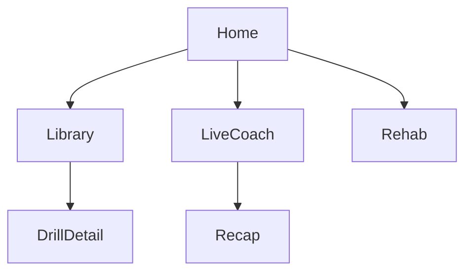

# SetPoint AI — Phase 1 Handoff

Parent index: [`SETPOINT_AGENT_HANDOFF.md`](SETPOINT_AGENT_HANDOFF.md)  
Phase 2 (after 8.6 — referee + content): [`SETPOINT_PHASE2_HANDOFF.md`](SETPOINT_PHASE2_HANDOFF.md)

Do **not** re-scaffold the app. Continue from the Flutter project at repo root.

**Repo:** https://github.com/e88040429-code/SportsAiAPP.git (`setpoint_ai`)  
**Run:** `flutter run -d chrome`

**Ask AI (optional Gemini):**

```bash
# Terminal 1 — PowerShell: $env:GEMINI_API_KEY="your_key"
dart run tool/ai_proxy.dart

# Terminal 2
flutter run -d chrome --dart-define=AI_PROXY_URL=http://localhost:8787
```

Badge **Offline tips** = mock fallback; **Live agent** = Gemini via proxy.

---

## Product summary

**SetPoint AI** — AI motion analysis for **football, volleyball, basketball**. Pose estimation vs coach reference libraries → tips on form, balance, symmetry, timing.

**Phase 1 goal:** real live pose pipeline in Coach + Recap from a recorded session (iters **8.1–8.6**). Live AI referee (Iter 9) lives in Phase 2.

UI was volleyball-first (orange `#FF7F32`); multi-sport switcher exists. Branding: `lib/core/constants/app_strings.dart`.

---

## Phase 1 status

| Iteration | Status | What shipped |
|-----------|--------|--------------|
| **0 Foundation** | Done | Flutter scaffold, theme, `go_router` shell, web, `.gitignore` |
| **1 Home UI** | Done | Dashboard with mock metrics, session, skills, continue learning |
| **2 Pose Library** | Done | Search, Training/Rehab toggle, chips, drill list (mock) |
| **3 Drill Detail** | Done | Description, key positions timeline, video **placeholder** (mock) |
| **4 Live Coach shell** | Done | Dark HUD, camera preview, **fake** skeleton, cue + metrics (mock), record UI |
| **5 Session Recap** | Done | Score, You vs Coach, joint angles, rep chart (mock) |
| **6 Rehab Hub** | Done | Readiness, program, exercise checklist (mock) |
| **7 Multi-sport** | Done | Football / volleyball / basketball switcher; screens filter by sport |
| **Ask AI / Gemini** | Done (extra) | Chat UI + `CoachAiAgent` + proxy |
| **8 Pose pipeline** | **Next** | Real `pose_detection` — **8.1–8.6** below |

**Important:** Navigation/widgets are largely in place. **Almost all feature data is still mock** (`*MockData` under `lib/features/*/data/`). Pose overlay is fake until Iter 8. Tests are thin (`test/widget_test.dart`).

### Key paths

```
lib/
  main.dart, app.dart
  core/theme/, core/router/, core/config/, core/sport/
  features/home|library|coach|recap|rehab|sports|ai_response/
```

### Theme / nav / packages

- Primary `#FF7F32`, background `#F8F8F8`, coach dark `#121212`; Inter via `google_fonts`
- Tabs: Home | Library | Coach | Recap | Rehab; drill: `/library/drill/:drillId`
- Packages: `google_fonts`, `go_router`, `camera`, `http` (Ask AI)
- Real pose: use **`pose_detection`** (web + iOS + Android), **not** ML Kit

### Conventions

- Feature folders with `data/` + `widgets/`
- Small iterations; preserve mockup look
- `flutter analyze` + `flutter test`; Chrome-first
- Commit/push only when asked



---

## Remaining Phase 1 work

Finish **8.1 → 8.6**. Do **not** start Phase 2 until **8.6 is Done** (unless the user says otherwise). Iter **9** (live AI referee) is documented in Phase 2.

| Iter | Focus | Deliverable | Packages |
|------|--------|-------------|----------|
| **8** | Real pose pipeline | **8.1–8.6** below | [`pose_detection`](https://pub.dev/packages/pose_detection) |

---

## Iteration 8 — Fake skeleton → real pose detection

**Current state:** `CoachCameraPreview` live; `FakeSkeletonOverlay` / `PoseSkeletonPainter` hardcoded; cues/metrics from `CoachMockData`.

**Order:** Detect → draw on body → metrics/cues → compare to reference → recap.

**Stack:** [`pose_detection`](https://pub.dev/packages/pose_detection) (BlazePose-style ~33 landmarks → map to painter in 8.3). Web via LiteRT.js. No ML Kit unless a later mobile-only gap forces it.

### 8.1 — Add `pose_detection` and pose service shell

- Add package; `PoseDetectorService` under `lib/features/coach/pose/`; emit `PoseFrame`; dispose with Coach screen.
- **Done when:** creates on Chrome (and mobile if available); Coach UI does not regress.

### 8.2 — Feed camera / image frames into the detector

- Frames from `CameraController` → `Uint8List` / bytes (no `dart:io` `File` on web); throttle ~15–30 FPS; handle mirror/letterbox.
- **Done when:** frames reach detector without sustained freezes / OOM.

### 8.3 — Normalize landmarks into painter format

- Map ~33 → app joints/bones; image → overlay coords; shared `PoseFrame`.
- **Done when:** unit-testable mapping; still frame paints correctly.

### 8.4 — Replace fake overlay with live skeleton

- Swap `FakeSkeletonOverlay()` for live `PoseFrame` widget; keep painter drawing.
- **Done when:** skeleton tracks the athlete (not static fake).

### 8.5 — Derive coaching cues and metrics from pose

- Angles, symmetry, timing → `CueBubble` / `CoachMetricsBar` (not mock).
- **Done when:** cues/metrics update while moving.

### 8.6 — Wire recording → Session Recap

- Persist session pose/clip; Recap from real session data.
- **Done when:** recorded Coach session fills Recap (not mock-only).

### Phase 1 non-goals

- Live AI referee (Iter 9) → Phase 2
- Firebase/Flask content backend → Phase 2
- Expanding Ask AI unless requested

### Success (end of Phase 1)

Live pose in Coach (8.4+), real Recap from a session (8.6).
