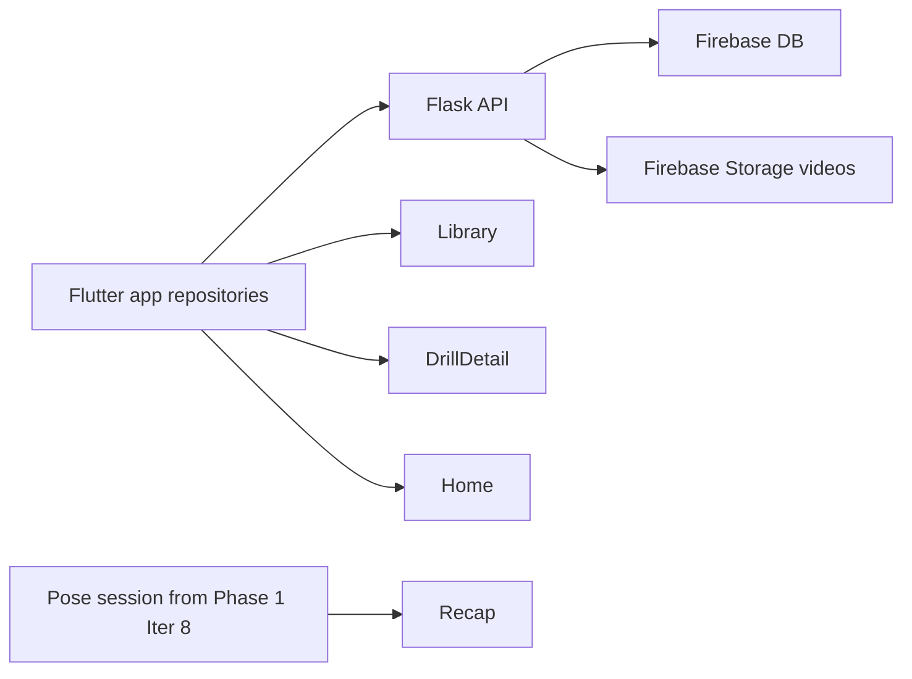

# SetPoint AI — Phase 2 Handoff

Parent index: [`SETPOINT_AGENT_HANDOFF.md`](SETPOINT_AGENT_HANDOFF.md)  
Phase 1 (pose / referee — finish first): [`SETPOINT_PHASE1_HANDOFF.md`](SETPOINT_PHASE1_HANDOFF.md)

**Gate:** Start Phase 2 only after **Iteration 8.6 is Done** and **Iteration 9 MVP is shipped** (unless the user redirects).

Do **not** re-scaffold the app. Flutter at repo root: https://github.com/e88040429-code/SportsAiAPP.git

**Flutter run:** `flutter run -d chrome`  
With API: `flutter run -d chrome --dart-define=API_BASE_URL=http://localhost:5000`

---

## Goal

Replace mock catalogs (`*MockData`) with a **live content pipeline** so Library, Home, Drill Detail (and related surfaces) use:

- Real **drill videos**
- Real **skill descriptions**
- Real **step / key-position breakdowns**

Testing is a **first-class** workstream — not an afterthought.

---

## Architecture (locked)

- **Firebase** — database + **Storage** for drill videos / media URLs
- **Flask** — HTTP API reads/writes Firebase, serves JSON to Flutter
- **Flutter** — repositories call Flask (**not** Firebase from UI widgets)

**Local run:**

1. Start Flask on localhost (e.g. port 5000)
2. Flutter: `--dart-define=API_BASE_URL=http://localhost:5000`
3. Firebase credentials stay **server-side** in Flask env — **do not commit secrets**

---

## Phase 2 iterations

| Iter | Focus | Deliverable |
|------|--------|-------------|
| **10** | Testing foundation | Expand Flutter tests (widget + unit); Flask smoke/unit tests where cheap; create [`QA_SMOKE_CHECKLIST.md`](QA_SMOKE_CHECKLIST.md). `flutter test` + checklist = **exit gate** for every later slice |
| **11** | Firebase + Flask + Flutter repository | Schema for drills/skills (`id`, sport, training/rehab, title, description, steps, video URL); Flask list/filter + get-by-id; `DrillContentRepository`; mock fallback only if API down |
| **12** | Seed copy + step breakdowns | Real descriptions + key-position timelines in Firebase — **volleyball** first, then football/basketball; wire Library + Drill Detail |
| **13** | Drill video pipeline | Firebase Storage → URLs via Flask; `video_player` on Drill Detail; loading/error/empty; web-safe |
| **14** | App-wide live wiring | Home / Featured / Rehab from API/session; remove direct `*MockData` from screens |
| **15** | Regression + release QA | Flutter + Flask suites green; full manual smoke + bug pass; document known gaps |

---

## Testing expectations

Every iter **Done when** = automated green **and** relevant checklist section signed off.

### Automated (Flutter)

- `flutter analyze`
- `flutter test` — models/API parsing; widget tests with fake repository; cheap nav smoke tests

### Automated (Flask)

- Route tests: list/get drill, errors, empty catalog

### Developer smoke (manual)

Maintain [`QA_SMOKE_CHECKLIST.md`](QA_SMOKE_CHECKLIST.md) (create in Iter 10). Minimum paths:

- API health (up vs down)
- Library → filter → drill → **video plays** + **steps visible**
- Coach record → Recap populated
- Ask AI: Offline tips vs Live agent
- Sport switch refreshes API content
- Rehab checklist interactions

### Bug process

- Log repro (screen, sport, API up/down, expected vs actual)
- Fix **blocking** bugs before the next Phase 2 iter

---

## Conventions

- Prefer **Flutter repository → Flask → Firebase** over new `*MockData`
- No Firebase secrets in the Flutter web app
- Do **not** expand AI referee scope inside iters 10–15
- Small slices; commit/push only when asked

## Non-goals

- Rewriting Phase 1 UI from scratch
- Replacing `pose_detection` with ML Kit “just in case”
- Full auth/user accounts unless the user expands scope

## Success (end of Phase 2)

Drill videos, descriptions, and step breakdowns served from Firebase via Flask; screens not dependent on mock catalogs; automated tests + QA smoke checklist prove the platform works as intended.
